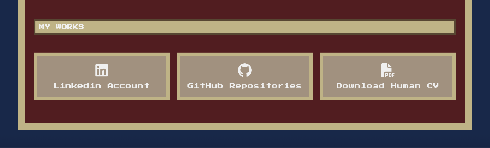

# "Codex Vitae: The Full Stack Knight"

"Codex Vitae" è un progetto front-end che rappresenta il mio CV in modo originale e fantasioso.

Per poterne esplorare tutte le funzionalità direttamente dal browser, il progetto è disponibile anche online tramite GitHub Pages, accedendo a [QUESTO LINK](https://leonardonotaristefano-dev.github.io/CodexVitae/).

## Obiettivi del Progetto

L'obiettivo principale era riprodurre il mio percorso professionale da Web Developer. 
Il sito include animazioni dinamiche, le mie skill, le mie certificazioni, i miei progetti e ovviamente la possibilità di effettuare il download del CV tradizionale. E' stato progettato per non annoiare troppo i recruiter!

## Tecnologie Utilizzate

 - *HTML5*
 - *CSS3*
 - *JavaScript*
 - *Bootstrap*

## Struttura del Progetto

Il progetto è organizzato nei seguenti file:

- **index.html**: Unica page, che presenta l'introduzione con un'immagine animata rappresentativa del mio avatar e a seguire tutte le informazioni personali e professionali.

- **style.css**: Il file CSS che definisce lo stile del sito, inclusi colori, font e layout responsivo.

- **script.js**: Il file JavaScript principale che gestisce l'interattività del sito come le animazioni. 

- **media/**: cartella che contiene tutte le immagini e le animazioni utilizzate nel sito.

## Design e Stile

Per il design, ho scelto una combinazione di colori che trasmette uno stile fantasy e medievale:
- **Sfondo body**: #13294B;
- **Sfondo section**: #58181F;
- **Bordo section**: #C2B280;
- **Testo titoli**: #f0f0f0;

I font utilizzati sono:
- **Press Start 2P** per i titoli
- **Monospace** per i paragrafi

Queste scelte contribuiscono a creare un'esperienza visiva piacevole per l'utente.
I fonts sono stati importati da Google Fonts.

## Considerazioni

Attraverso **CodexVitae**, ho potuto dare sfogo alla mia originalità e passione, aiutando i recruiter a bere una tazzina di caffè in meno perchè stanchi di visionare classici CV in bianco e nero!

Per ulteriori informazioni, non esitare a contattarmi!
---
